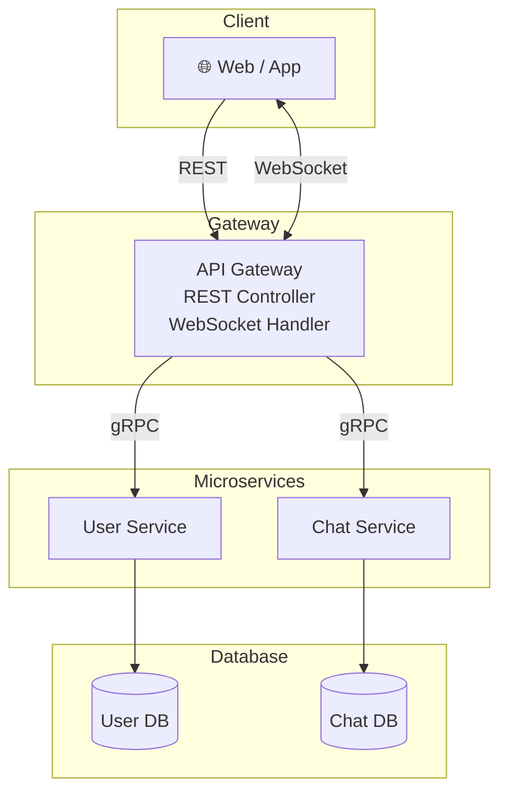

# msa-study
## MSA Chat Project

This project is Jiwoon's small-scale personal project.\

## Tech Stack

- Spring Boot
- Spring Security
- JWT
- Spring WebSocket
- gRPC
- MySQL
- JPA

## Architecture

## Services

- Gateway
- User Service
- Chat Service
- Frontend

## Features

- 회원가입
- 로그인
- JWT 인증
- 실시간 채팅
- 채팅 저장

## Project Structure

gateway/\
user-service/\
chat-service/\
frontend/\
proto/

## Development Log

### 2026-06-30
- Initialized Spring Boot project
- Set up project structure
- Added Spring Security and JPA dependencies
